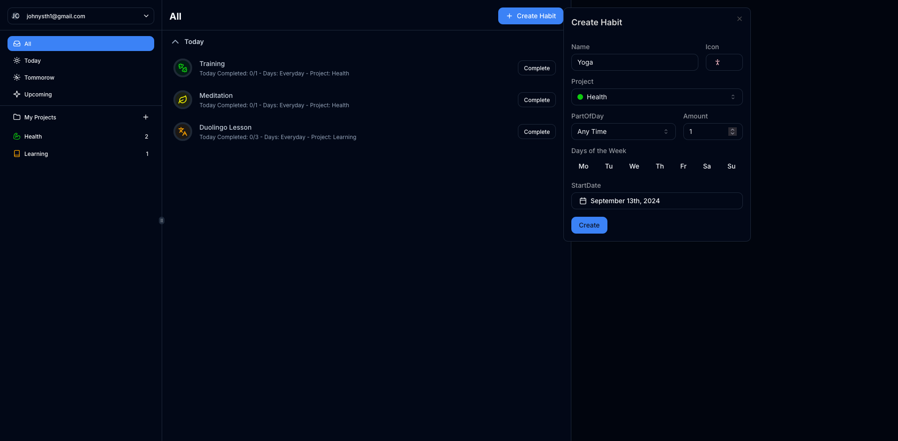
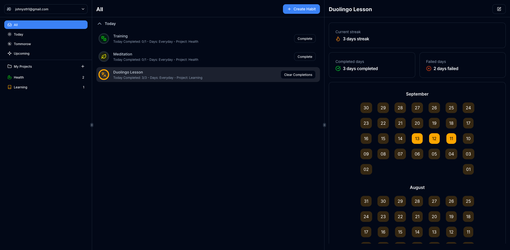
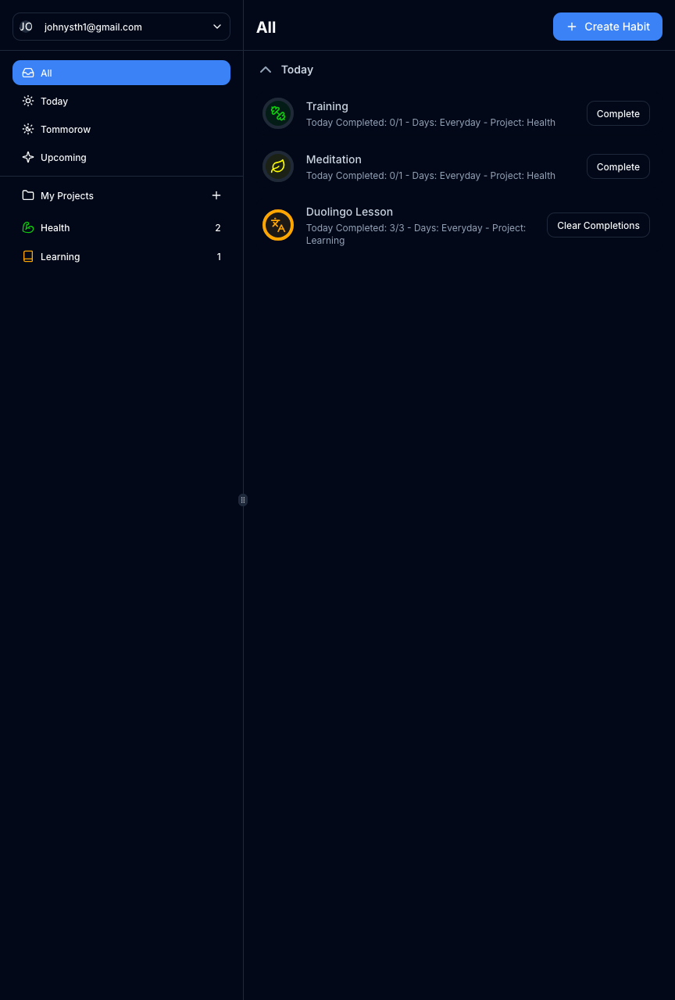
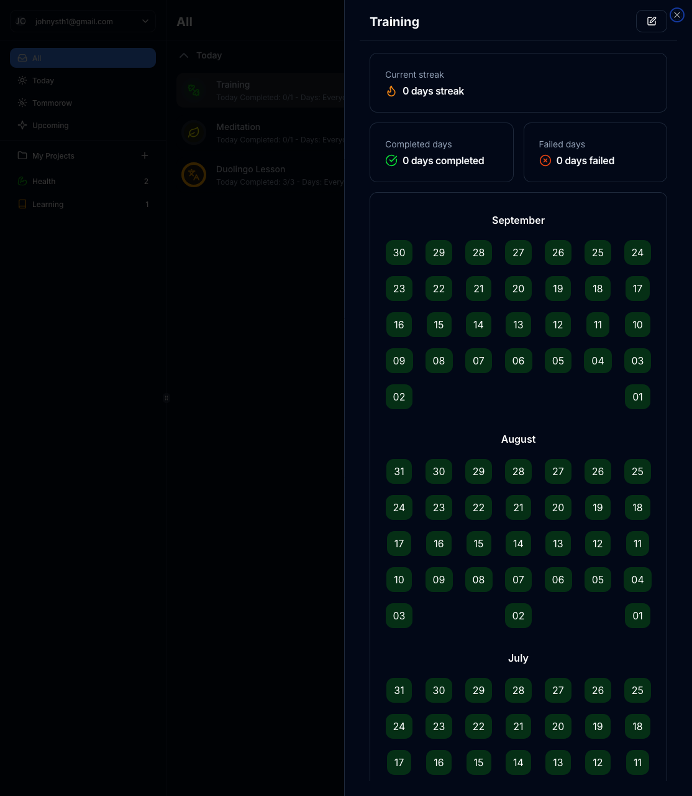
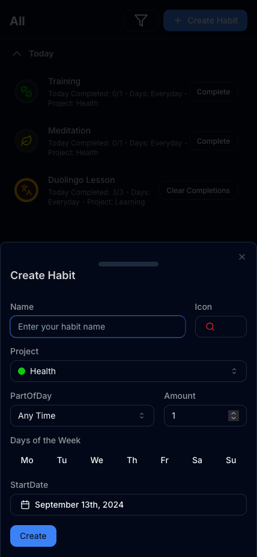
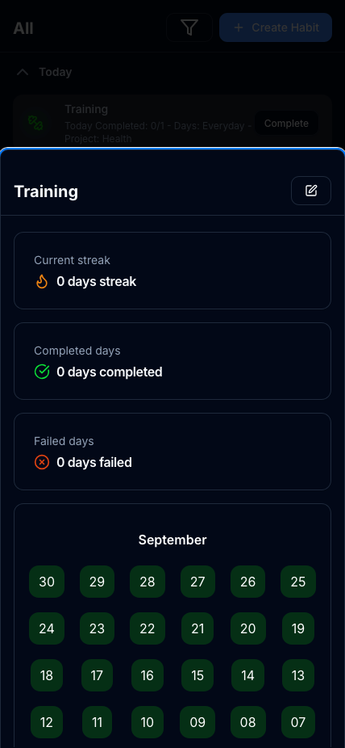

# Habit Tracker Web App

## Description

This is a simple habit tracker web app that allows users to track their habits.

You can check the live version [here](https://supabase-nextjs-flame.vercel.app/).

## Technologies

### Front-end

- Next JS (React)
- Tailwind CSS
- Shadcn components
- Zustand

### Backend

- Supabase

## Images

### Desktop

### Tablet

  
  

## Mobile

  
  
  

